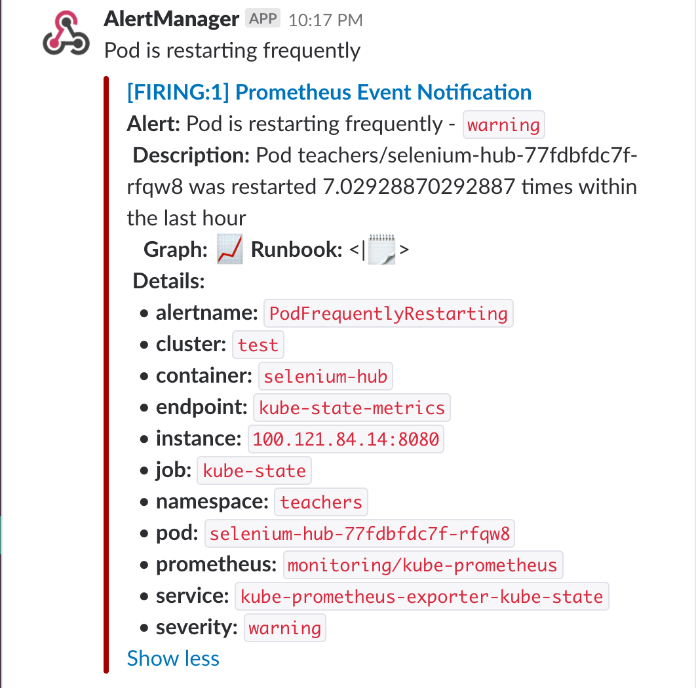

# prometheus-operator-alerts
Add slack or smtp alerts to prometheus operator

The way you would set it up globally in your organization is to have 1 alertmanager cluster, and N prometheus servers ... the prometheus servers select the servicemonitors and rules across namespaces (in whatever suits your organization).

The Prometheus Operator uses PrometheusRule CRDs. This addresses the need for rule syntax validation and rule selection across namespaces. It is quite handy so teams can self-service and add alerts.

For a pager duty per service, the team would create a PrometheusRule in their app's namespace with a single alertmanager route, using an alert label to choose the pagerduty notifier, or same with slack channel. That way you only need one alertmanager config for everything.

## deploy.sh

This script will use helm to install the prometheus operator and kube-prometheus charts, and configure them to send alerts to slack OR email (not both).

## generate-alert-manager-config-secret.sh

This script will replace the alert-manager secret with a revised version. Handy to iterate over solutions rapidly.

## Sample Slack Alert

Let's have a look in more detail:



* **Summary**, here we can see a clear concise summary of the issue, this is far more readable than the formatting of the actual alert name in Prometheus allows.
* **Description**, allows us to detail more relevant information.
* **Severity**, a user defined field that allows us to perform some basic classification of alerts and can be used to inform notification preferences.
* **Graph**, a link to the relevant query using the Prometheus graph interface, this usually requires some additional config that's detailed further down.
* **Runbook**, allows you to specify the URL of a runbook that's associated to an alert. For example; a disk usage alert on a database server could link through to a runbook on how to safely clear it down. This can be super useful to ensuring smooth and predictable responses to common issues from on-call teams.
* **Details**, in this section we range through additional fields that are present to ensure we are representing all the essential info.

### What else?

You should know the prometheus operator does not support annotation based scrapes [because reasons](https://github.com/coreos/kube-prometheus/pull/16#issuecomment-305933103).

You should also know that there is work to centralize Grafana dashboards and Prometheus alerts for Kubernetes in the [monitoring-mixin](https://github.com/kubernetes-monitoring/kubernetes-mixin) project.

If you install the vanilla prometheus operator and kube-prometheus, it's hard to know what all is where. It's also hard to compare it to solutions like [the non-helm prometheus operator](https://github.com/camilb/prometheus-kubernetes) or [other prometheus setups](https://github.com/kayrus/prometheus-kubernetes). You can run these to see what they configure out of the box:


```
kubectl get secret  alertmanager-kube-prometheus -o go-template='{{ index .data "alertmanager.yaml" }}' | base64 -D
```

`kubectl get configmap kube-prometheus-grafana -o yaml`
Shows grafana dashboards


```
mkdir -p default
cd default
kubectl get configmaps kube-prometheus -o go-template='{{ index .data "general.rules" }}' > general.rules

kubectl get configmap kube-prometheus-exporter-node -o go-template='{{ index .data "node.rules" }}' > node.rules

kubectl get configmaps kube-prometheus-exporter-kubernetes -o go-template='{{ index .data "kubernetes.rules" }}' > kubernetes.rules

kubectl get configmaps kube-prometheus-exporter-kubelets -o go-template='{{ index .data "kubelet.rules"}}' > kubelet.rules

kubectl get configmaps kube-prometheus-exporter-kube-state -o go-template='{{ index .data "kube-state-metrics.rules"}}' > kube-state-metrics.rules

kubectl get configmaps kube-prometheus-exporter-kube-scheduler -o go-template='{{ index .data "kube-scheduler.rules"}}' > kube-scheduler.rules

kubectl get configmaps kube-prometheus-exporter-kube-etcd -o go-template='{{ index .data "etcd3.rules"}}' > etcd3.rules

kubectl get configmaps kube-prometheus-exporter-kube-controller-manager -o go-template='{{ index .data "kube-controller-manager.rules"}}' > kube-controller-manager.rules

kubectl get configmaps kube-prometheus-alertmanager -o go-template='{{ index .data "alertmanager.rules" }}' > alertmanager.rules

kubectl get configmap  kube-prometheus-prometheus -o go-template='{{ index .data "prometheus.rules" }}' > prometheus.rules
```
